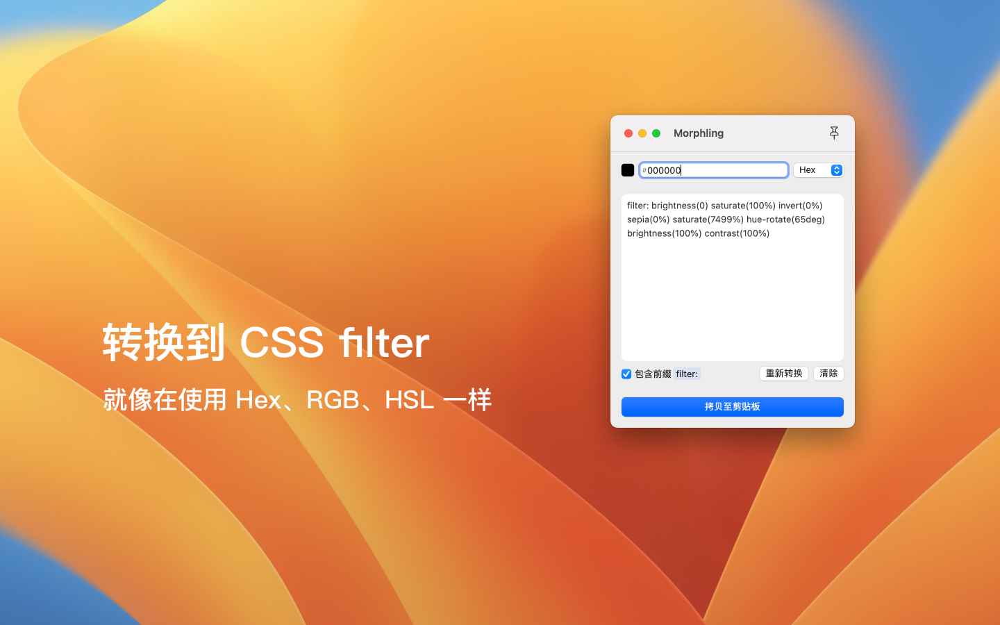

# Morphling

[English](./README.md) | 简体中文

## ✨ 特性

- [x] 免费且开源
- [x] 通过 JavaScriptCore 使用 npm 包
- [x] 暗黑模式
- [x] 多语言

## 📦 分发方式

## 👍 致谢

- [color](https://github.com/Qix-/color)
- [CSS Filter Converter](https://github.com/OvidijusParsiunas/css-filter-converter)
- [LaunchAtLogin-Modern](https://github.com/sindresorhus/LaunchAtLogin-Modern)
- [Remix Icon](https://github.com/Remix-Design/RemixIcon)
- [3dicons](https://3dicons.co/)

## 📜 许可证

MIT License - Copyright (c) 2023 SvenFE
