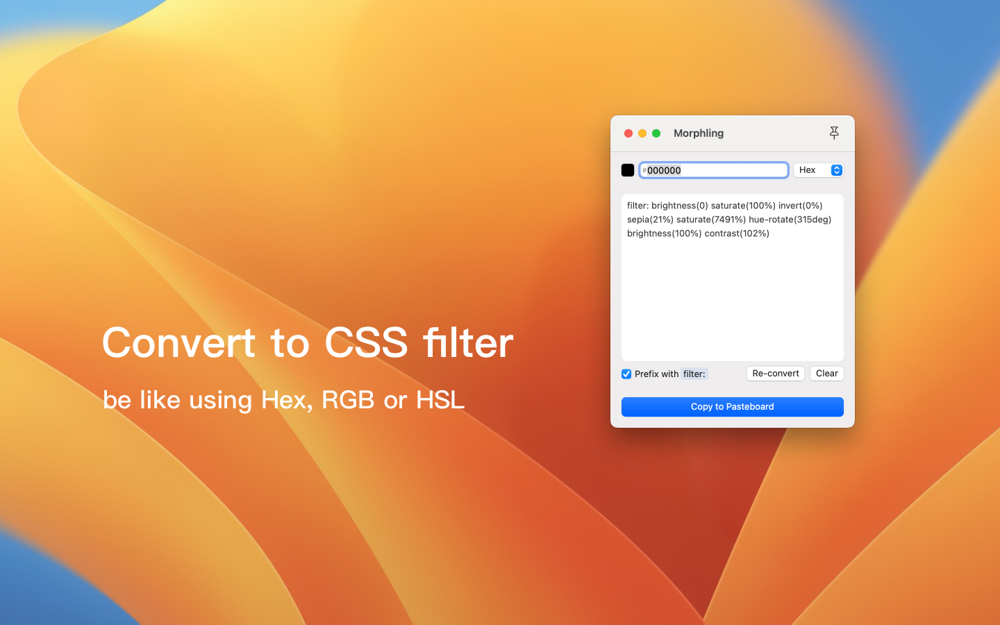

# Morphling

English | [简体中文](./README-zh-hans.md)

The reason for this is that when changing the color of a monochrome svg icon in a front-end project, different developers' icon packages may not get the desired color after adding the CSS attribute `fill` or `color`, but using the CSS `filter` attribute can force the change.

Thanks to the [CSS Filter Converter](https://github.com/OvidijusParsiunas/css-filter-converter) project, which provides a JavaScript implementation of the algorithm.

I only brought his web implementation to the macOS desktop as a native SwiftUI.

## ✨ FEATURES

- [x] free and open source
- [x] using npm packages via JavaScriptCore
- [x] dark mode
- [x] multiple languages

## 📦 DISTRIBUTION

If the download is not available, Apple is still reviewing it and you can try it first from TestFlight.

https://testflight.apple.com/join/1QM2WgE2

## 👍 CREDITS

- [color](https://github.com/Qix-/color)
- [CSS Filter Converter](https://github.com/OvidijusParsiunas/css-filter-converter)
- [LaunchAtLogin-Modern](https://github.com/sindresorhus/LaunchAtLogin-Modern)
- [Remix Icon](https://github.com/Remix-Design/RemixIcon)
- [3dicons](https://3dicons.co/)

## 📜 LICENSE

MIT License - Copyright (c) 2023 SvenFE
