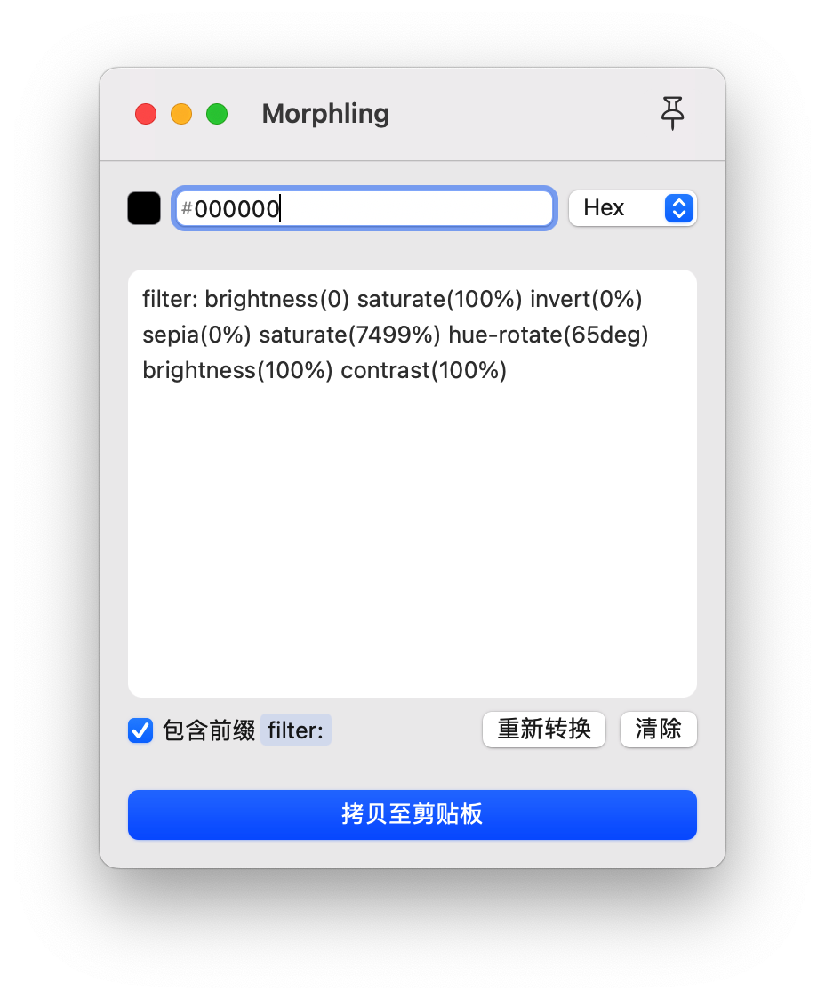

# Morphling

🎨 Convert to `css filter` be like using `Hex`, `RGB` or `HSL`

## 📦 Distribution

not release yet

## 👍 CREDITS

- [color](https://github.com/Qix-/color)
- [CSS Filter Converter](https://github.com/OvidijusParsiunas/css-filter-converter)
- [LaunchAtLogin-Modern](https://github.com/sindresorhus/LaunchAtLogin-Modern)
- [Remix Icon](https://github.com/Remix-Design/RemixIcon)
- [3dicons](https://3dicons.co/)
